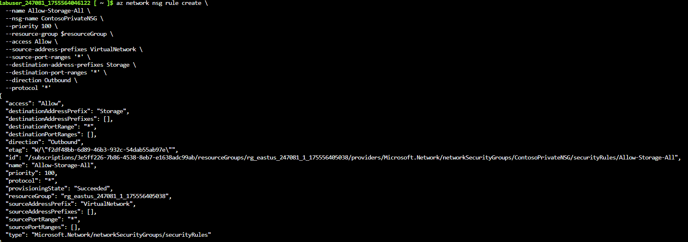
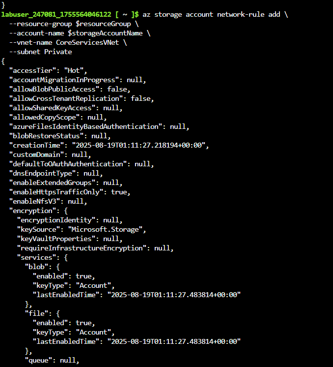
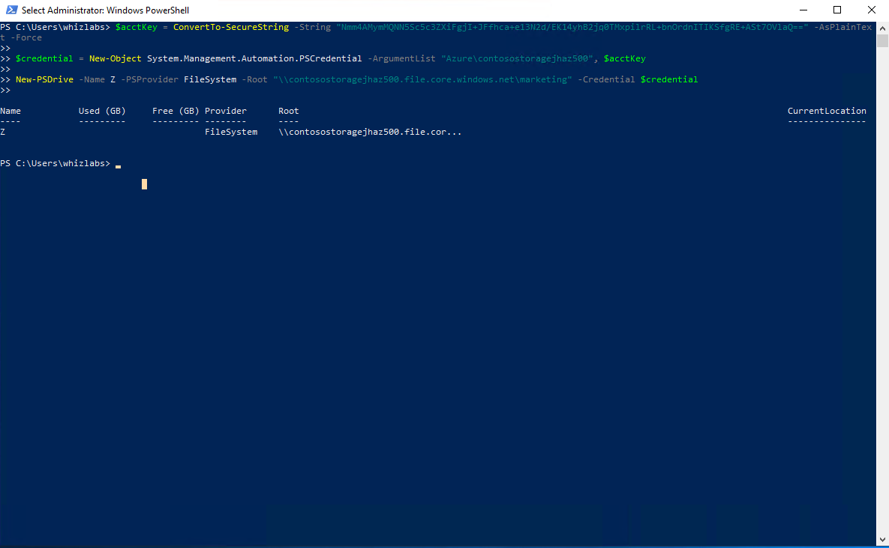
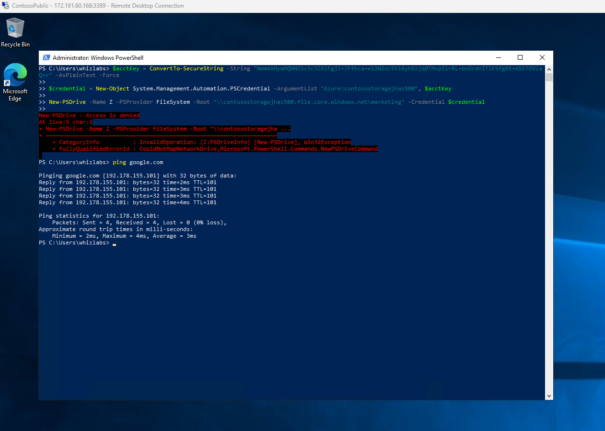

## Azure Virtual Network Security Lab  

---

**Type:** Lab Project — Whizlabs Azure Lab  
**Skills:** Network Segmentation, Zero Trust Principles, NSG Hardening, Storage Account Firewalling, Defense-in-Depth, Azure Security  

---

### Overview  
This lab focused on implementing **secure network design** in Azure by enforcing isolation between subnets, restricting storage access at the network layer, and validating that workloads follow the principle of least privilege. By combining NSGs, service endpoints, and storage account firewalls, I created a layered defense model to protect sensitive data and control VM traffic flows.   

---

### Objectives:  
- Design a segmented VNet with isolated public and private subnets  
- Apply NSG rules to restrict outbound internet traffic while permitting storage access  
- Harden a storage account to only allow traffic from trusted subnets  
- Deploy VMs in different trust zones and validate security boundaries  
- Demonstrate defense-in-depth with layered controls at subnet, NSG, and storage firewall levels

---  

### What I Did  
#### 1) **Network Segmentation**  
- Built **CoreServicesVNet** with Public and Private subnets  
- Enforced a **service endpoint** on the Private subnet to securely connect to Azure Storage without public exposure  

#### 2) **NSG Hardening**  
- Created **ContosoPrivateNSG** to apply zero-trust style rules:  
  - Allow outbound traffic only to Azure Storage  
  - Deny all outbound internet traffic from the Private subnet  
  - Allow inbound RDP for secure management access  
- Bound the NSG to the Private subnet to enforce policy consistently  

#### 3) **Storage Account Firewalling**  
- Created a storage account with a file share (`marketing`)  
- Restricted access to only the Private subnet using network rules  
- Enabled **default deny** on the storage account to block all non-trusted sources  

#### 4) **Controlled Workload Deployment**  
- Deployed two VMs to test network boundaries:  
  - **ContosoPrivate VM** (Private subnet) → storage access allowed, internet blocked  
  - **ContosoPublic VM** (Public subnet) → internet allowed, storage access blocked  

#### 5) **Validation of Security Posture**  
- Verified Private VM could mount the secure file share but could not ping the internet  
- Verified Public VM had internet connectivity but failed to connect to the storage account  
- Demonstrated **least privilege in practice**: each subnet and VM only had access to what was explicitly allowed

--- 

### Screenshots

### NSG Rules Applied to Private Subnet

### Storage Account Network Rules

### ContosoPrivate VM – Allow Storage Access

### ContosoPublic VM – Denied Storage Access | Verified Outbound Access

  
---

References  
Whizlabs – Azure Networking and Security Lab  
Microsoft Documentation – [Virtual Network](https://learn.microsoft.com/azure/virtual-network/virtual-networks-overview), [NSG](https://learn.microsoft.com/azure/virtual-network/network-security-groups-overview), [Storage Firewalls](https://learn.microsoft.com/azure/storage/common/storage-network-security)  
